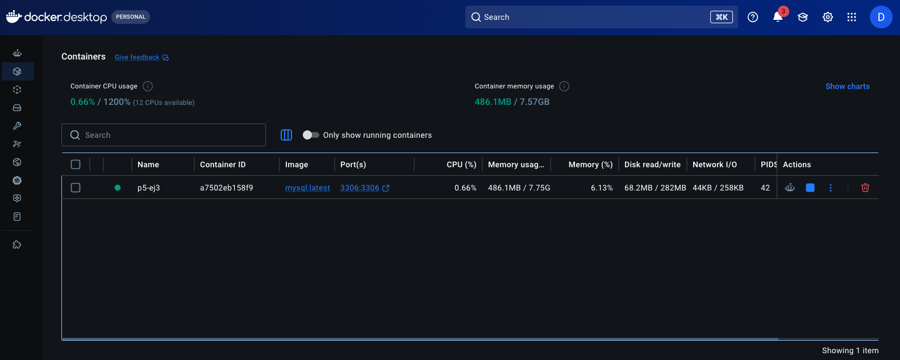
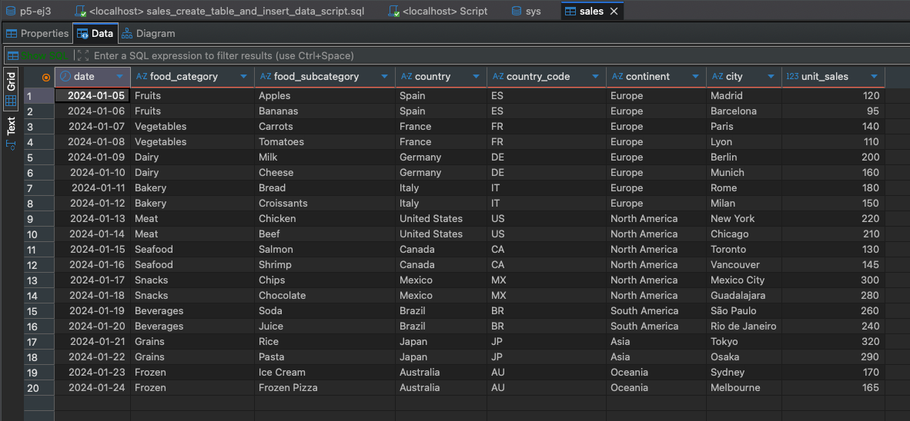
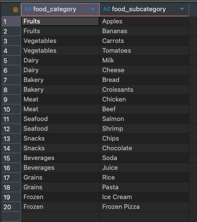
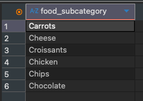
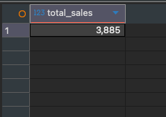
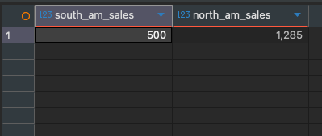

# factoria F5 - Ejercicio: SQL Sales

## Descripción:
Este ejercicio debería realizado para practicar SQL y Docker. 
Además yo uso DBeaver para conectar al base de datos creado. 

## Etapas:

1. Crea una base de datos MySQL en Docker

    

3. Crea la tabla "sales" (ver script proporcionado)

    

4. Crear un script para obtener todos los datos de la columna food category y subcategory

    

5. Crear un script para obtener solo las sub categorías que empiezan por la letra "C"

    

7. Crear un script para obtener la cantidad total de unidades vendidas

    

9. Crear un script para obtener la unidades totales del continente americano

    

11. Crea un repositorio con el Readme
12. Aloja los scripts en tu repositorio
  - [Script 1](scripts/script-SQL-1.sql)
  - [Script 2](scripts/script-SQL-2.sql)
  - [Script 3](scripts/script-SQL-3.sql)
  - [Script 4](scripts/script-SQL-4.sql)

9. Inserta en el Readme la descripción del ejercicio

